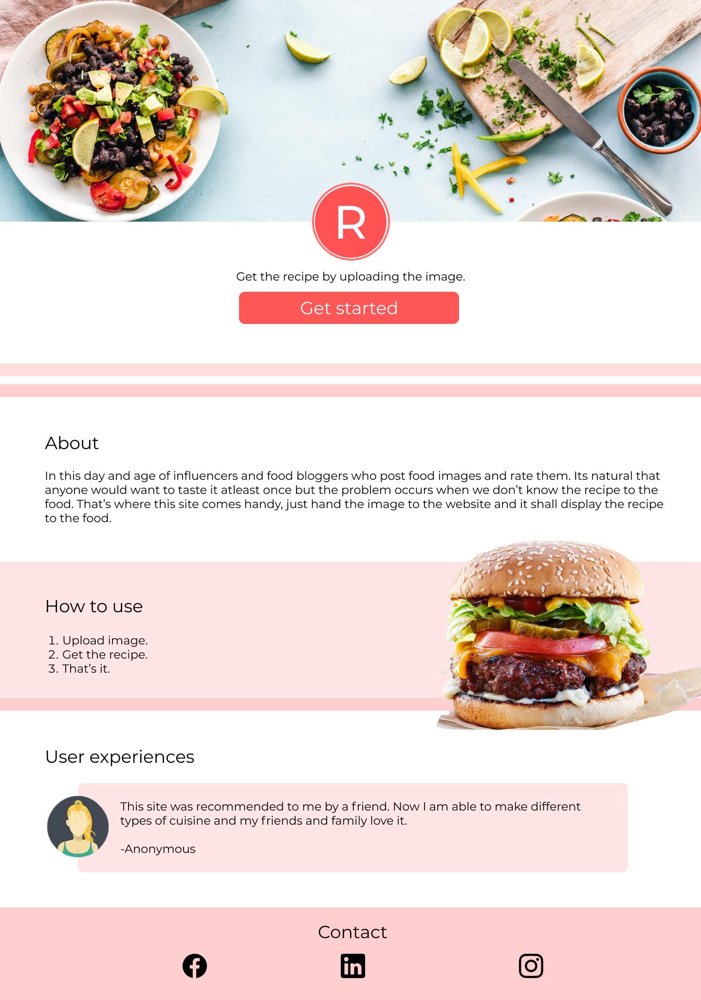
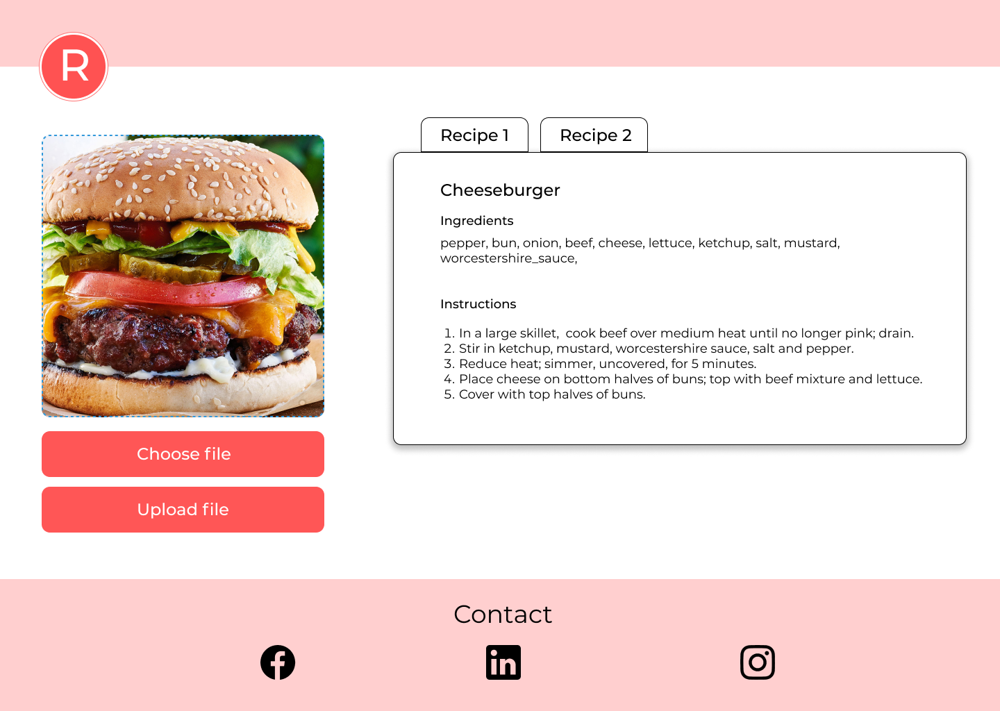

# Recipe Generation from Food Image

This project creates a web site which takes in food image and returns the recipe, ingredients and title of the food.

## How to run the project

### Client side 
Download all dependencies using 

#### `npm i`

Then to host it locally using

#### `npm start`

The web app will be at [http://localhost:3000/]( http://localhost:3000/)

### Server side

Download all dependencies using 

#### `pip install`

Then to host it locally using

#### `python run.py`

The server will be running at [http://localhost:5000/]( http://localhost:5000/)
